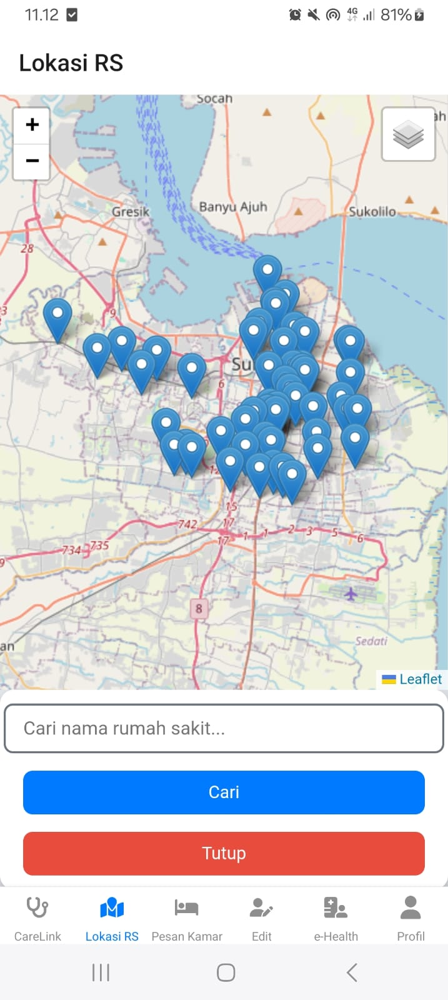
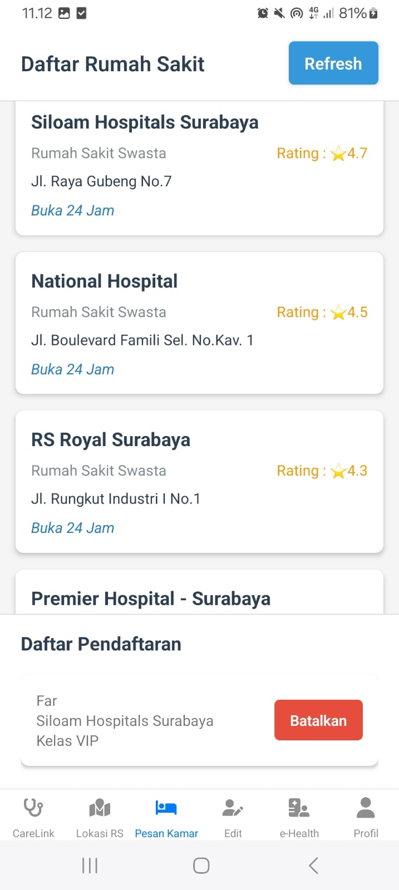
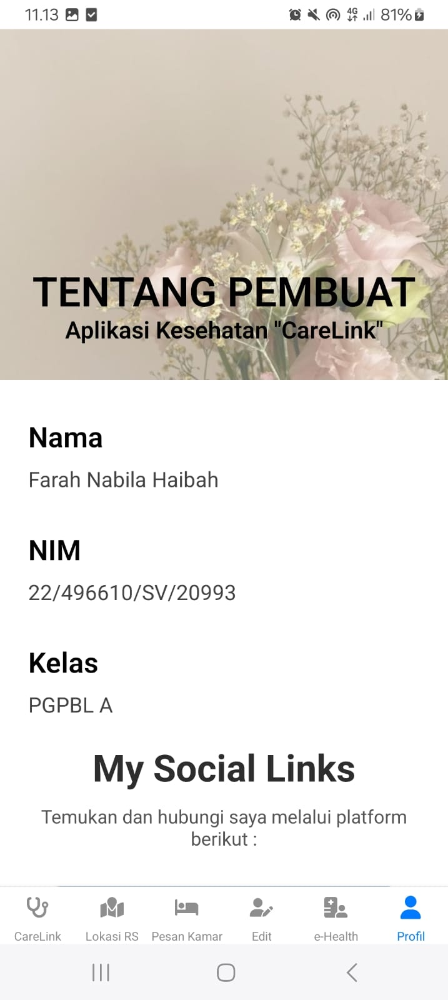
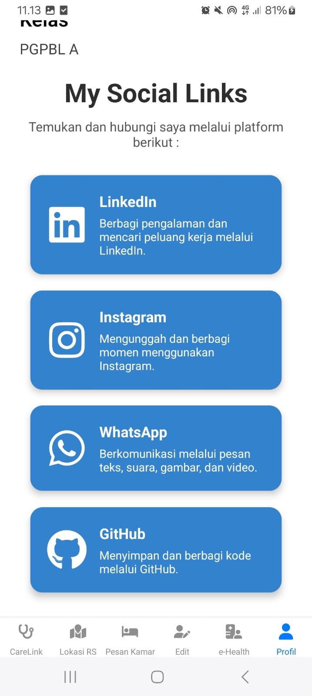

# 📱 **CareLink - Aplikasi Kesehatan Digital**

---

## ✨ **Deskripsi Produk**

**CareLink** adalah aplikasi mobile berbasis **React Native** yang dirancang untuk membantu pengguna dalam mengelola dan mengakses informasi rumah sakit serta layanan kesehatan dengan cepat dan mudah. Aplikasi ini memiliki berbagai fitur untuk memudahkan navigasi layanan kesehatan, informasi rumah sakit, serta komunikasi melalui berbagai media sosial.

---

## 🛠️ **Komponen Pembangun Produk**

Aplikasi ini dibangun dengan menggunakan teknologi dan pustaka berikut:

- **React Native** - Framework untuk membangun aplikasi lintas platform yang cepat dan responsif.
- **React Navigation** - Untuk navigasi antar halaman dengan lancar.
- **FontAwesome** - Digunakan untuk menampilkan ikon media sosial dan ikon navigasi.
- **Axios** - Untuk komunikasi dengan server menggunakan HTTP request.
- **React Native Maps** - Untuk menampilkan peta lokasi rumah sakit dan tempat layanan kesehatan.
- **State Management dengan Hooks** - Menggunakan React hooks untuk mengatur state dan manajemen data.

---

## 🔗 **Sumber Data**

Aplikasi ini mengambil data dari berbagai sumber server dengan endpoint sebagai berikut:

- **URL API Data Rumah Sakit: http://192.168.56.41:3000/rumahsakit**  

Data ini mencakup informasi rumah sakit seperti alamat, rating, kontak, dan informasi terkait layanan kesehatan.

---

## 📸 **Tangkapan Layar**

### 🏠 **Tampilan Landing Page**
Halaman utama dengan tampilan informasi pembuat aplikasi dan gambaran umum aplikasi.

---

### 🏠 **Tampilan Peta Lokasi**
Peta yang ditampilkan dengan sebaran titik lokasi rumah sakit di Kota Surabaya disertai dengan fitur search untuk mempermudah pencarian titik lokasi.

---

### ✏️ **Formulir Pesan Kamar**
Formulir ini memungkinkan pengguna untuk melakukan pemesanan kamar pasien di rumah sakit yang telah dipilih.

---

### ✏️ **Formulir Edit Data Rumah Sakit**
Formulir ini memungkinkan pengguna untuk mengedit data rumah sakit dengan mudah.

---

### 🏥 **Daftar Rumah Sakit**
Tampilan daftar rumah sakit dengan detail seperti alamat, rating, dan kontak.

---

### 🔗 **Profil Penyusun**
Profil penyusun aplikasi kesehatan Kota Surabaya "CareLink".

---
### 🔗 **Navigasi Media Sosial**
Menu navigasi untuk mengakses berbagai tautan komunikasi seperti WhatsApp, Instagram, LinkedIn, dan GitHub.

---